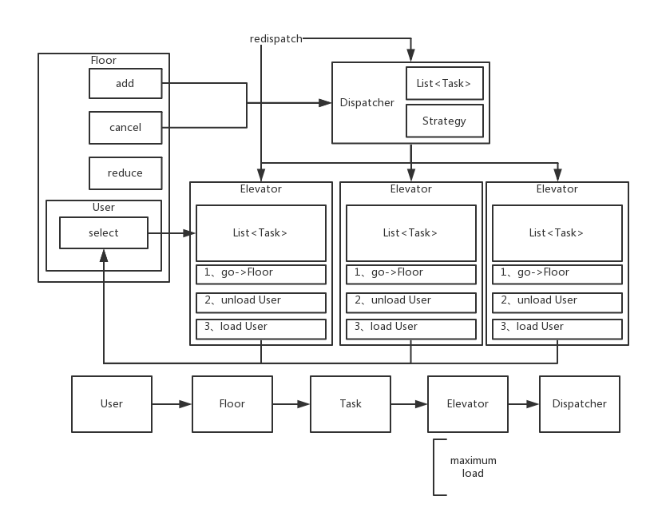

[](https://travis-ci.org/lhyundeadsoul/ElevatorSystem)
[](https://circleci.com/gh/lhyundeadsoul/ElevatorSystem)
[](https://codebeat.co/projects/github-com-lhyundeadsoul-elevatorsystem-master)
[](https://www.codacy.com/app/lhyundeadsoul/ElevatorSystem?utm_source=github.com&amp;utm_medium=referral&amp;utm_content=lhyundeadsoul/ElevatorSystem&amp;utm_campaign=Badge_Grade)


# ElevatorSystem
a Multi-elevator System

## Design


# Run it
```$xslt
mvn clean -DskipTests=true package
nohup java -jar ~/Sources/ElevatorSystem/target/elevator-system-1.0-SNAPSHOT-jar-with-dependencies.jar {dispatch-strategy} {priority-strategy} >/dev/null 2>&1 &
```
> dispatch-strategy = RandomDispatch / PriorityFirstDispatch
 
> priority-strategy = SameDirectionNearestFirst

## Feature
1. support multi-task/multi-elevator dispatch
2. support elevator maximum load
3. support most of operations of elevator e.g. grab/cancel/abandon
4. support dispatch strategy extensible endpoint

## Legacy Problem
- [x] 电梯来了，和用户方向不同，用户也不能上
- [x] dispatcher任务分配优先级还没排查
- [x] 电梯任务抢占
- [x] todo
- [ ] UT
- [x] CI
- [x] 全部电梯满载时会死循环
- [x] 加入吞吐、平均等待时间等指标
- [x] RejectedExecutionException
- [ ] 梳理所有竞争代码块，检查是否有未处理的情况
- [ ] 尝试设计新的strategy
- [ ] 系统开发中遇到的细节问题总结梳理